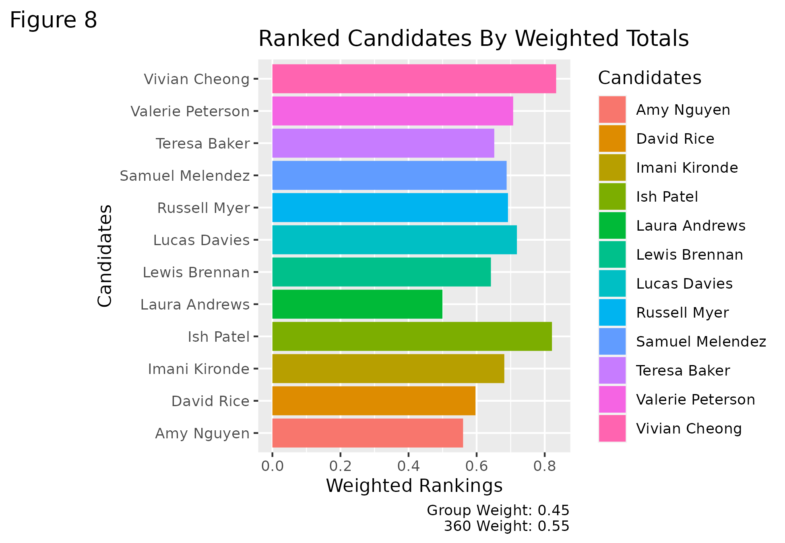
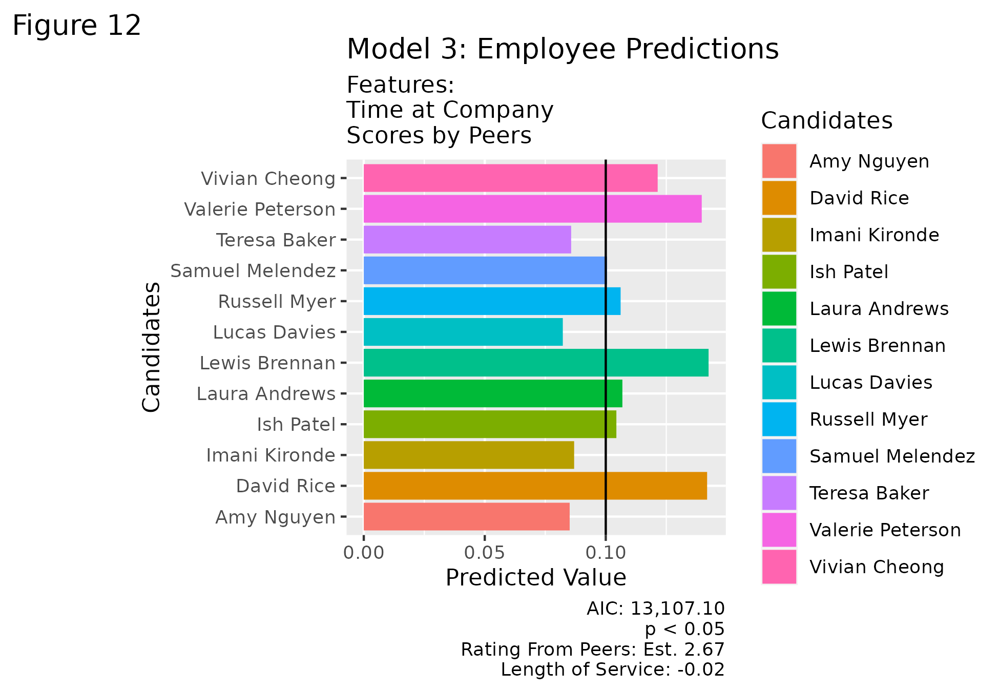

# Leadership-And-People-Analytics
This body of work identifies the top candidate for a simulated position given a list of resumes. The work involved reviewing &amp; ranking candidates, collaborating with cross-disciplinary team members, visualizing the rankings of team members, &amp; creating a model to identify who is promotable given a dataset of historical promotions at other companies.

- [Hiring Committee: Final Report](./Hiring_Committee.pdf)
- [Hiring Commitee: R Source Code](./Hiring_Committee.rmd)
- [Candidate Rankings Per Team Member & Final Grouped Average Ranking Given the Sum of 360 Simulated Peer-Scoring Weights and the Normalized Weighted Rankings of the Group](./Weighted%20Buckets%20-%20Weighted_Totals_And_Rankings.csv)
- [Linear Model Employee Training Data](https://www.kaggle.com/datasets/arashnic/hr-ana?select=train.csv)
- [Linear Model Employee Test Data](Weighted%20Buckets%20-%20Employee_data.csv)

# Final Grouped Average Ranking Given the Sum of 360 Simulated Peer-Scoring Weights and the Normalized Weighted Rankings of the Group:

# Prediction of Employee Promotion Given Historical Promotions of Employees

My performance during this Leadership & People Analytics course earned a nomination for distinction from the teaching team based upon the extent to which I:
- Demonstrated a superior level of mastery of course content
- Made exemplary efforts in engagement and participation throughout the program
- Upheld and championed Community Values
